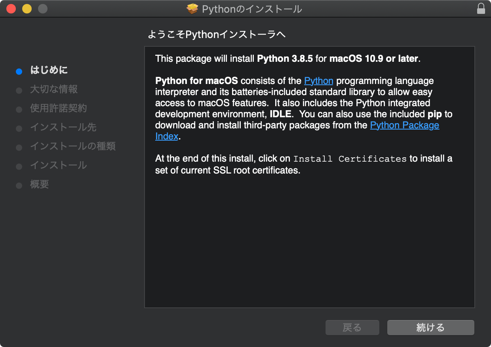
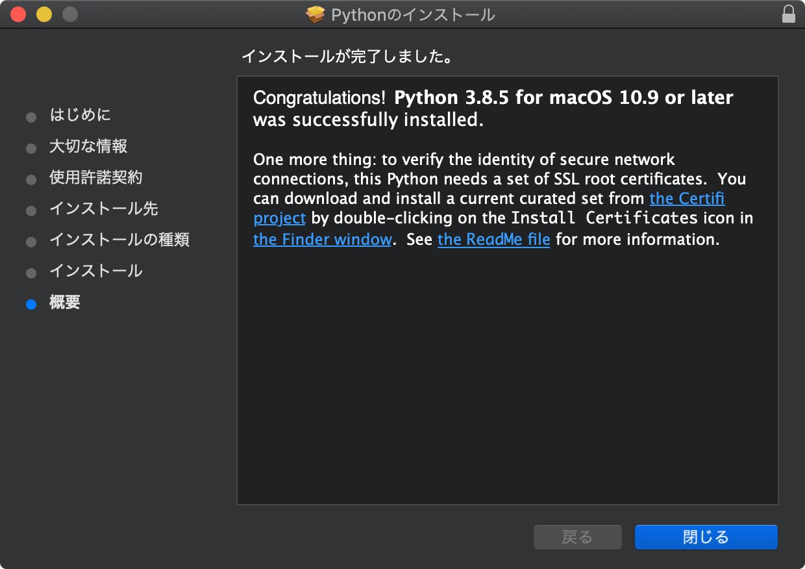
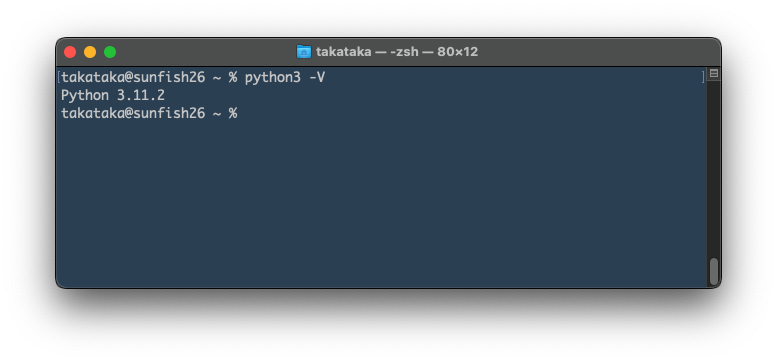

# Python のインストール macOS編

[setupへ戻る](README.md)

## Python のインストール

macOS では最初から Python が入ってたり，Apple が提供している Python をインストールできたりもしますが，バージョンが古いです．ここでは https://www.python.org/ から Python のパッケージをダウンロードしてインストールする方法を説明します．

**(1) Pythonのパッケージをダウンロードする**

上記のウェブページへアクセスして「Downloads」にカーソルを置くと，「Donload for macOS」と記された窓が開いて「Python 3.X.Y」（X, Y は数字）というボタンが出現します． それをクリックしてファイルをダウンロードします． このファイルは， Python のパッケージとインストーラ（インストールを実行するプログラム）を兼ねてます．

**【注意】 これを書いている時点では，上記で表示される Python のバージョンは 3.11.2 です．以下の画像では古いバージョン（3.8.5など）になっているかもしれません．適宜読み替えてください．**

**(2) インストーラを起動してインストールする**

1. Finder で「ダウンロード」フォルダを開き， ダウンロードした pkg ファイルをダブルクリック． Python インストーラが起動する．
1. インストーラの説明を読んで先へ進み，インストールを開始
1. Finderで「アプリケーション」フォルダを開くと，「Python 3.11」というフォルダができているはず





# インストールできたことの確認／Terminal で Python 動かしてみる

**(1) ターミナルを起動**

Finder で「アプリケーション」 > 「ユーティリティ」 > 「ターミナル」 をダブルクリック

以下のようなウィンドウが開くはず．よく使うので，起動後に Dock （アイコンがならんでるバー）の「ターミナル」のアイコンを選択して右クリック（タッチパッドの場合は長押しまたはCTRL押しながらクリック） > オプション > Dock に追加，としとくとよいでしょう．



**(2) ターミナル 内で python3 コマンドを -V オプション付きで実行**

1. 次のように入力して Enter．最初の `%` は入力しません．`V` は大文字です．
`% python3 -V`
1. バージョンが表示されるので，↑でインストールしたものと等しいかどうか確認する．違っている場合は，他のバージョンの Python がすでにインストールされていて，そっちが優先される設定になっているのかもしれません．その場合は対処法を相談してください．

**【注意】 コマンドは `python` ではなく `python3` です．** 環境によっては，3 のつかない `python` で Python 2.7 等の古いバージョンが起動することがあります．

**(3) ターミナル内で Python インタプリタを起動してコードを実行してみる**

Python のプログラムは，1行ずつキー入力して逐次実行させることができます．試してみましょう．

```
% python3
（ここに Python のバージョンなどが表示される）
>>> x = 4649    （左端の >>> は自分が入力する文字ではない． x 以降を入力して Enter）
>>> y = 1314
>>> print(x+y)
（x + y の値が表示される）
>>>   （CTRL+Dで Python インタプリタを抜ける）
```

［おまけ］「ターミナル」を起動して，画面上部のメニューバーで「ターミナル」 > 「環境設定」 > 「プロファイル」等で，文字サイズとか背景色とかいろいろいじれます．

## アンインストールの仕方

takataka に尋ねてね．

[setupへ戻る](README.md)