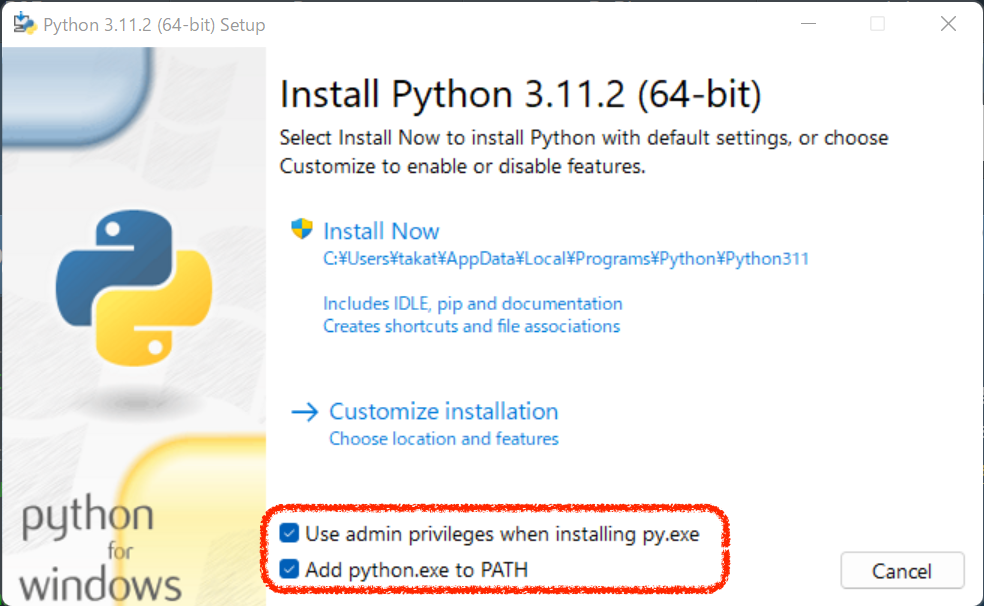
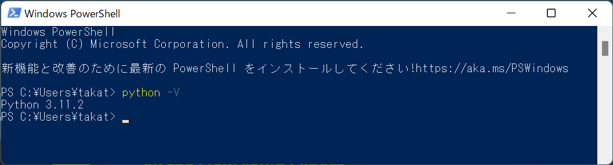

# Python のインストール Windows編

[setupへ戻る](README.md)

## Python のインストール

https://www.python.org/ から Python のパッケージをダウンロードしてインストールします．

**(1) Pythonのパッケージをダウンロードする**

上記のウェブページへアクセスして「Downloads」にカーソルを置くと，「Donload for Windows」と記された窓が開いて「Python 3.X.Y」（X, Y は数字）というボタンが出現します． それをクリックしてファイルをダウンロードします． このファイルは， Python のパッケージとインストーラ（インストールを実行するプログラム）を兼ねてます．

<span style="color:red">これを書いている時点では，上記で表示される Python のバージョンは 3.10.2 です．以下の画像では古いバージョン（3.9.6など）になっているかもしれません．適宜読み替えてください．</span>

**(2) インストーラを起動してインストールする**

1. ダウンロードされたインストーラを開いて実行する．
1. 以下のようなウィンドウが出てくる．
    - 「Install launcher for all users」 という項目にデフォルトでチェックがついてる．このままだと，自分以外のユーザも使えるように設定することになるが，管理者権限が必要となる．「管理者権限をもってない」場合や「他のユーザでも使えるようにする必要はない」場合は，チェックはずせばよい
    - <span style="color:red">「Add Python 3.10 to PATH」という項目にはデフォルトではチェックがついてない．必ずチェックをつける．</span>

1. 「Install Now」をクリックしてインストール開始．
1. 完了すると「Setup was successful」と表示される．
1. 「Close」を押す．

# インストールできたことの確認／PowerShell で Python 動かしてみる

スタートメニューの「Python 3.10 なんたら」から起動して確認する手もありますが，ここでは別の方法で．

**(1) Windows PowerShell を起動**

スタートメニュー > Windows PowerShell > Windows PowerShell

以下のようなウィンドウが開くはず．PowerShell は今後よく使うので，タスクバー（画面下のアイコンバー）で当該アイコンを選んで右クリックして，「タスクバーにピン留め」しとくとよいかも．



**(2) PowerShell 内で python コマンドを -V オプション付きで実行**

1. 次のように入力して Enter．最初の '>' は入力しません． V は大文字です．
`> python -V`
1. バージョンが表示されるので，↑でインストールしたものと等しいかどうか確認する．違っている場合は，他のバージョンの Python がすでにインストールされていて，そっちが優先される設定になっているのかもしれません．その場合は対処法を相談してください．

**(3) PowerShell 内で Python インタプリタを起動してコードを実行してみる**

Python のプログラムは，1行ずつキー入力して逐次実行させることができます．試してみましょう．

```
> python
（ここに Python のバージョンなどが表示される）
>>> x = 4649    （左端の >>> は自分が入力する文字ではない． x 以降を入力して Enter）
>>> y = 1314
>>> print(x+y)
（x + y の値が表示される）
>>>  （CTRL+Zを押してから Enter で Python インタプリタを抜ける）
```

## アンインストールの仕方

アンインストールしたくなったときのためにその方法を書いておきます

1. メニューから「設定 > アプリ」と進み「Python 3.X.Y」をクリックして「アンインストール」．
1. アンインストールが始まる
1. 「Python Launcher」もあったら同様にアンインストール

[setupへ戻る](README.md)