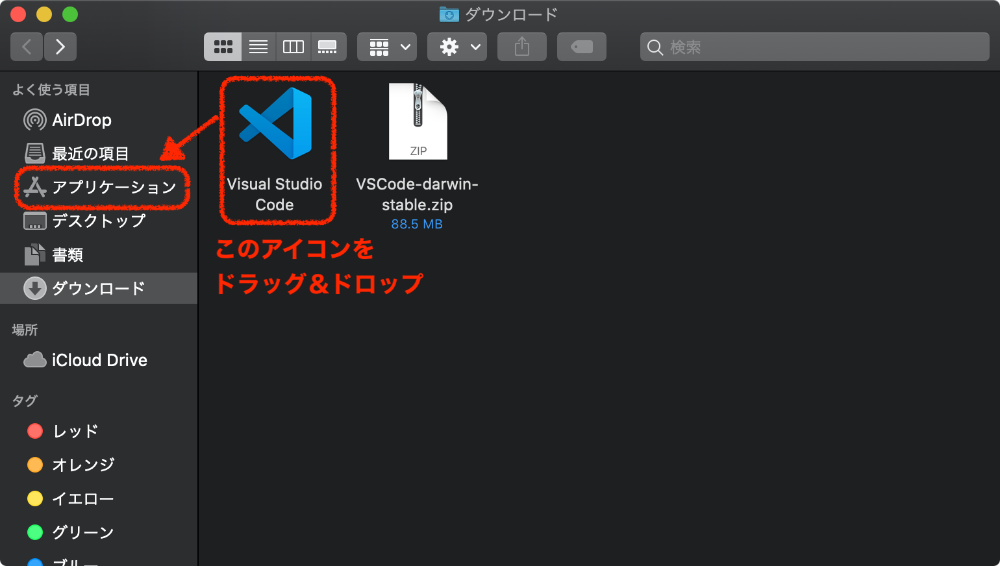

# Visual Studio Code のインストール Mac編

[setupへ戻る](README.md)

**(1) ダウンロードサイトへ**: https://code.visualstudio.com/download

**(2) 特に理由がなければ Mac と記された箱の下の Universal をクリックしてダウンロード開始．**

「ダウンロード」フォルダに VSCode-darwin-universal.zip というファイルがダウンロードされる．

**(3) VSCode をインストール．**

1. Finder で「ダウンロード」フォルダを開き，上記の ZIP ファイルをダブルクリック．
    - Finder は，Dock （デフォルトで画面下に表示されてるアイコンバー）の左端にいる顔のアイコン
    - 設定によっては， ZIP ファイルが自動的に展開されてすでに↓の状態になってる場合もある
1. ZIP ファイルが展開されて 「Visual Studio Code」というアプリケーションができる．
1. Finder で「Visual Studio Code」を「アプリケーション」へ移動させる．

**(4) 起動**

Finderから 「アプリケーション」の中のアイコンをクリックするか，または「Launchpad」から． 起動後は，Dockのアイコンを右クリック（またはCTRL押しながらクリック）して「オプション」 > 「Dockへ追加」しとくとよいでしょう．

[setupへ戻る](README.md)