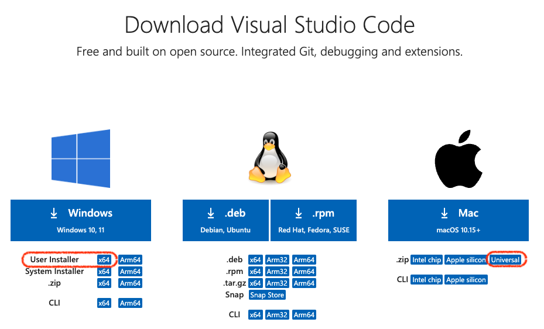

# Visual Studio Code のインストール Windows編

[setupへ戻る](README.md)

**(1) ダウンロードサイトへ**: https://code.visualstudio.com/download

**(2) 特に理由がなければ Windows と記された箱の下の User Installer の x64 を選択．**

「インストール対象のPCは自分が管理者で，システム全体に（自分以外のひとも使えるように）インストールしたい」というひとは，System Installer を選択するのもありです

**(3) ダウンロードしたインストーラを実行．**

1. 使用許諾契約書の同意
読んでokなら「同意する」にチェックをつけて「次へ」

1. インストール先の指定／スタートメニューフォルダの指定
デフォルトから変更したい理由がなければそのまま「次へ」

1. 追加タスクの選択
デフォルトでは「PATHへの追加」他いくつかだけチェックがついていると思いますが，他のも全部チェックつけとくことをおすすめします

1. インストール準備完了
「インストール」をクリックしてインストール開始

**(4) 起動**

インストールが完了すると自動で起動するかもしれませんが，通常は，デスクトップのアイコンをクリック，またはスタートメニューから「Visual Studio Code」を選択して起動します． 起動後は，タスクバーのアイコンを右クリック（またはCTRL押しながらクリック）して「タスクバーへピン留め」しとくとよいでしょう．

[setupへ戻る](README.md)