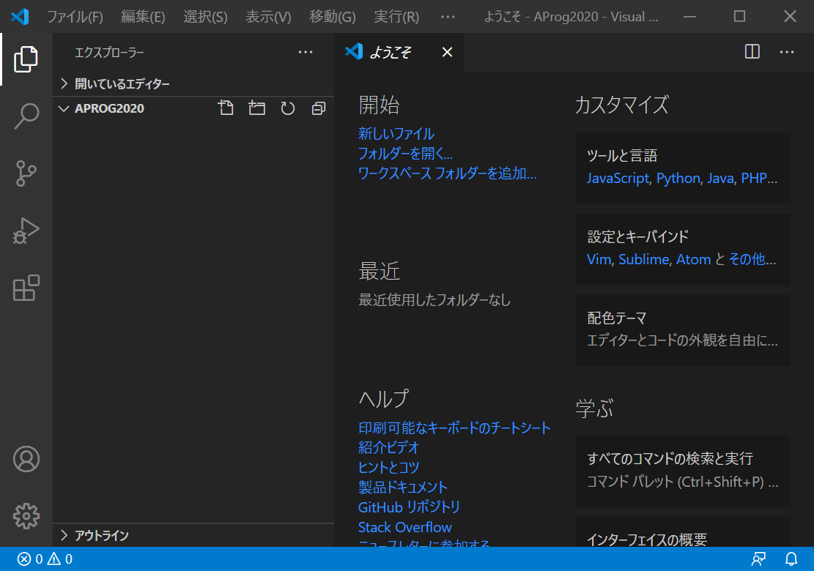
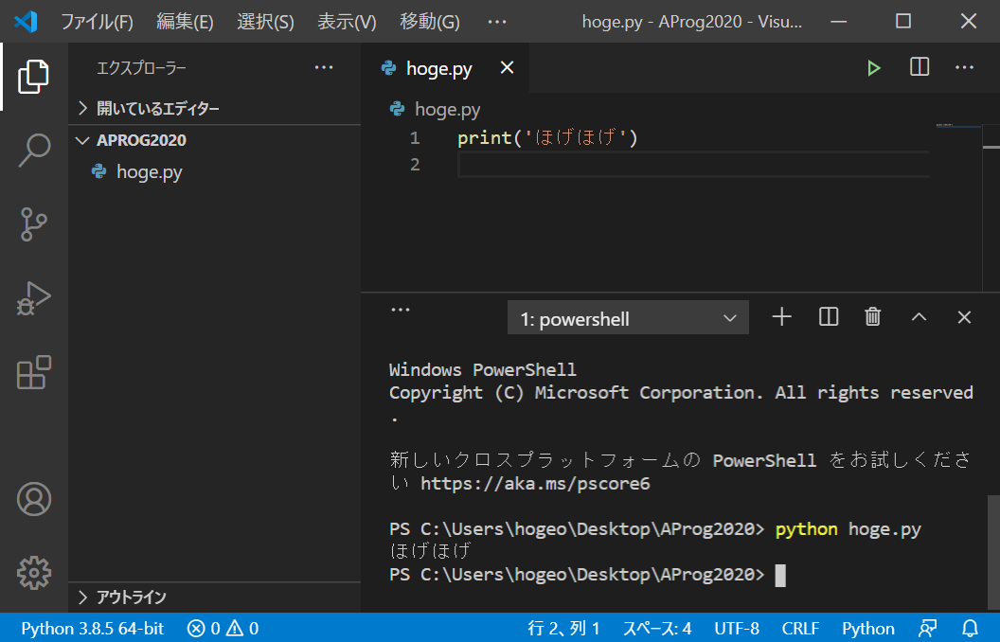

# 環境整備＋はじめての Python プログラミング macOS編

[setupへ戻る](README.md)

## 作業場所の整備

この授業の活動で作成・使用するファイルたちを置く場所として，デスクトップに SJE というフォルダを作成します．

**(1) Finder で拡張子が表示されるようにする．**

1. Finderを起動
1. 画面上部のメニューバーで 「Finder」 > 「環境設定」　とたどる
1. 「詳細」タブで「すべてのファイル名拡張子を表示」にチェックを入れる


**(2) ターミナルを開いて以下のようにコマンドを実行する．**

各行の先頭の `%` は自分で入力する文字ではありません．

```
%  cd
%  cd  Desktop
%  mkdir  SJE
```

**(3) デスクトップに SJE フォルダができているはず**


# VSCode の Python 開発環境の整備＋はじめての Python プログラミング

**(1) VSCode を起動**

**(2) メニューから「開く...」を押して，「デスクトップ」 > 「`SJE`」を選択**

- 初めて開くフォルダの場合，「このフォルダの作成者を信頼しますか？」と尋ねるポップアップウィンドウが現れるかもしれません．確認して「信頼する」にすればok
- **【注意】**
    - **特に理由がない限り，VSCode でファイルを開きたいときは，「ファイルを開く」ではなく，この説明のように「フォルダーを開く」ようにしましょう**
   - 以下の画像は Windows 版の VSCode なので少し異なるところがあります．また，別の授業のために撮ったのを使いまわしてるせいでフォルダ名が AProg2020 となってますが，正しくは `SJE` です．



**(3) ウィンドウ左の方のフォルダ名の近くにカーソルを持っていくと「新しいファイル」という説明のついたアイコンが出てくるのでクリック．**

**(4) ファイル名（ここでは `hoge.py` とする）を入力すると，編集画面が開く**


**(5) 上記のように「Python拡張機能」がおすすめされるので，インストールする**

Python extension for Visual Studio Code がインストールされます

**(6) `hoge.py` の中身を書いて保存する**

中身は
```
print('ほげほげ')
```
という1行だけ．「ほげほげ」の前後は「シングルクォーテーション」（一般的な日本語キーボードではShift+7）ですが，「ダブルクォーテーション」（Shift+2）でも構いません．

ファイルの保存は，「ファイル」>「保存」，または Command+S

**(7) VSCodeのウィンドウ下部のターミナルで `hoge.py` を実行してみる**

- **【注意】以下の画像は Windows 版のものなので，実際といろいろ違ってます（手抜きでごめんなさい）．特に，Mac では `python3` コマンドを使うことに注意．**
- VSCode 内にターミナルのウィンドウが表示されてなければ，「表示」>「ターミナル」で開けます
- `hoge.py` を実行するには次のように入力して Enter （`%` は自分が打つ文字ではありません）．
    ```
    % python3  hoge.py
    ```



**(8) ターミナル上でも実行してみよう**

1. ターミナルを起動
1. `cd` コマンドでフォルダを移動．以下のように `cd` コマンドを実行すれば SJE フォルダへ移動できる．
    ```
    % cd Desktop/SJE
    ```
    かわりに，次のように cd を2回実行してもよい．
    ```
    % cd Desktop
    % cd SJE
    ```
1. `ls` コマンドで現在のフォルダの内容を一覧．`hoge.py` が見えるはず．
    ```
    % ls
    ```
1. `python3` コマンドを，引数に `hoge.py` を指定して実行．
    ```
    % python3  hoge.py
    ```
1. ちゃんと実行されて結果が表示されることを確認しよう


[setupへ戻る](README.md)