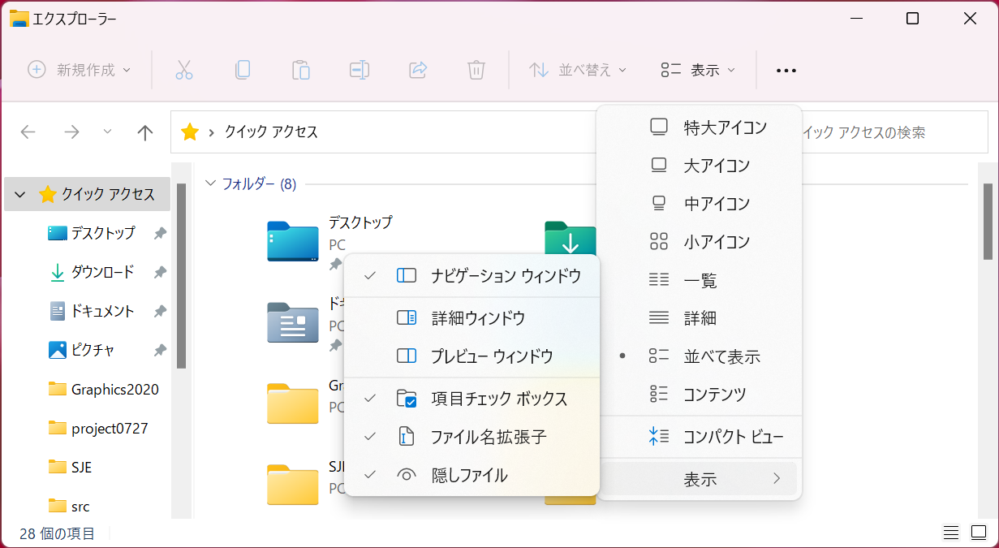
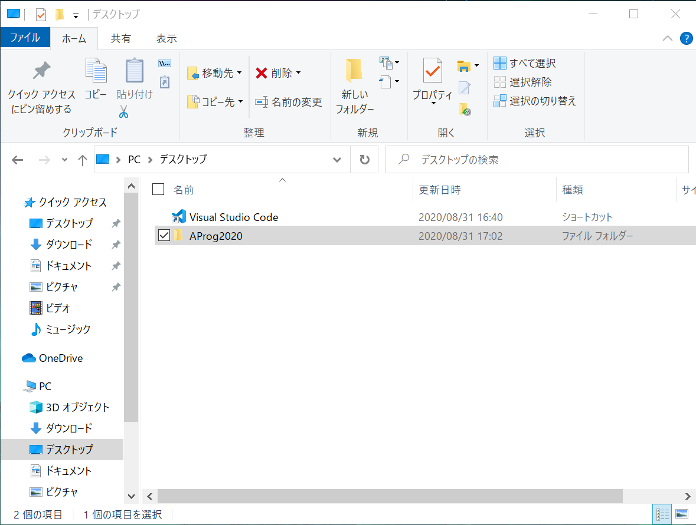
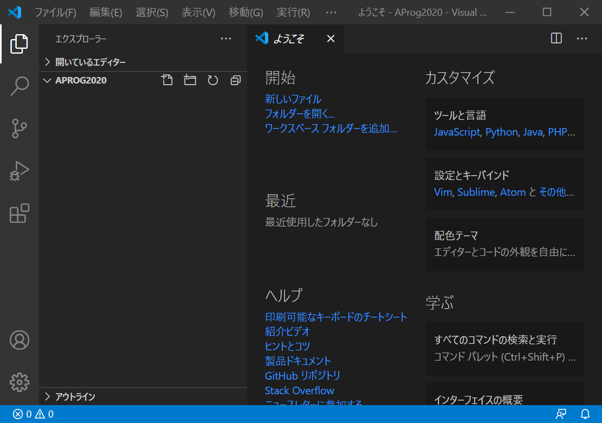
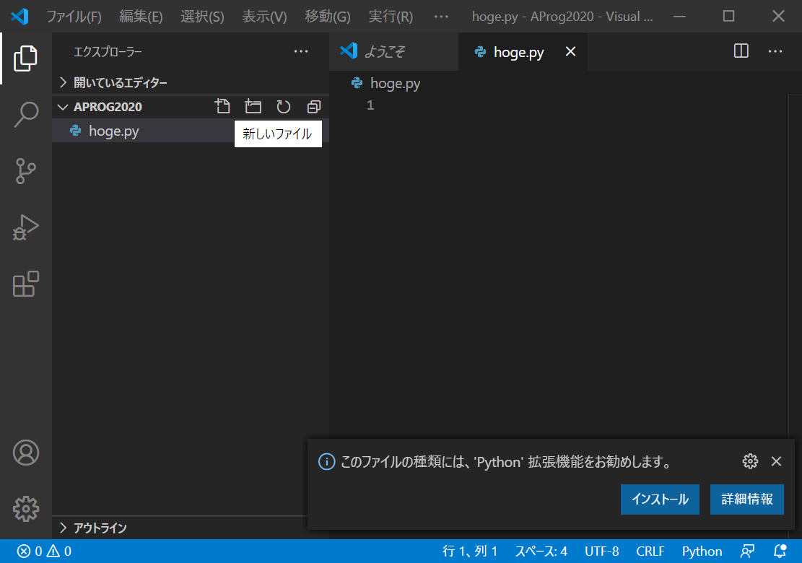
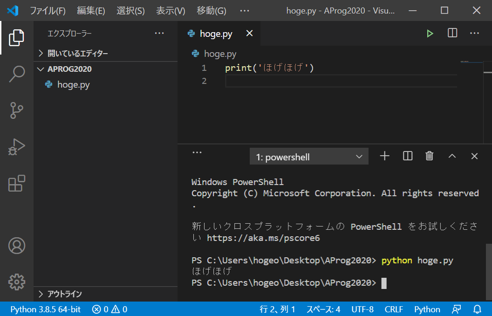
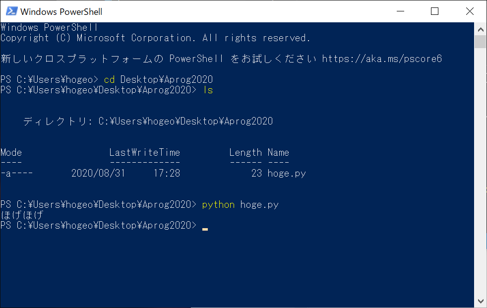

# 環境整備＋はじめての Python プログラミング Windows編

[setupへ戻る](README.md)

## 作業場所の整備

この授業の活動で作成・使用するファイルたちを置く場所として，デスクトップに SJE というフォルダを作成します．

**(1) エクスプローラーを起動．**「タスクバー」（画面下部のアイコンバー）にあるフォルダを模したアイコン．

**(2) 上部の「表示」タブを選択して「ファイル名拡張子」と「隠しファイル」にチェックを入れておく．**



**(3) 左のフォルダ一覧から「デスクトップ」を選択して，上部の「ホーム」タブから「新しいフォルダー」をクリック．フォルダの名前は `SJE` とする．**



**【注意】 上記の画像は別の授業のために撮ったのを使いまわしてるせいで AProg2020 となってますが，正しくは `SJE` です．**

**(4) デスクトップに AProg2021 フォルダができているはず**


# VSCode の Python 開発環境の整備＋はじめての Python プログラミング

**(1) VSCode を起動**

**(2) メニューから「ファイル」 > 「フォルダーを開く」を選択，「デスクトップ」 > 「`SJE`」を開く**

- 初めて開くフォルダの場合，「このフォルダの作成者を信頼しますか？」と尋ねるポップアップウィンドウが現れるかもしれません．確認して「信頼する」にすればok
- VSCode のインストール時に指示どおりにしていた場合，デスクトップの SJE フォルダを右クリックして「Codeで開く」として開くこともできます
- **【注意】特に理由がない限り，「ファイルを開く」ではなくこの説明のように「フォルダーを開く」を使いましょう**



**(3) ウィンドウ左の方のフォルダ名の近くにカーソルを持っていくと「新しいファイル」という説明のついたアイコンが出てくるのでクリック**

**(4) ファイル名（ここでは `hoge.py` とする）を入力すると，編集画面が開く**



**(5) 上記のように「Python拡張機能」がおすすめされるので，インストールする**

Python extension for Visual Studio Code がインストールされます

**(6) `hoge.py` の中身を書いて保存する**

中身は
```
print('ほげほげ')
```
という1行だけ．「ほげほげ」の前後は「シングルクォーテーション」（一般的な日本語キーボードではShift+7）ですが，「ダブルクォーテーション」（Shift+2）でも構いません．

ファイルの保存は，「ファイル」>「保存」，または CTRL+S

**(7) VSCodeのウィンドウ下部の PowerShell で `hoge.py` を実行してみる**

- VSCode 内に PowerShell ウィンドウが表示されてなければ，「表示」>「ターミナル」で開けます
- `hoge.py` を実行するには次のように入力して Enter （`>` は自分が打つ文字ではありません）．
```
> python3  hoge.py
```
- この授業で説明している手順で Python をインストールした場合は， python3 のかわりに python と打っても ok です．



**(8) VSCode とは独立した PowerShell からも実行してみよう**

1. PowerShell を起動．スタートメニュー > Windows PowerShell > Windows PowerShell
1. `cd` コマンドでフォルダを移動．以下のように `cd` コマンドを実行すれば SJE フォルダへ移動できる．
    ```
    >cd Desktop¥SJE
    ```
    かわりに，次のように cd を2回実行してもよい．
    ```
    >cd Desktop
    >cd SJE
    ```
1. `dir` または `ls` コマンドで現在のフォルダの内容を一覧．`hoge.py` が見えるはず．
    ```
    >ls
    ```
1. `python3` コマンドを，引数に `hoge.py` を指定して実行．
    ```
    >python3  hoge.py
    ```
1. ちゃんと実行されて結果が表示されることを確認しよう




[setupへ戻る](README.md)